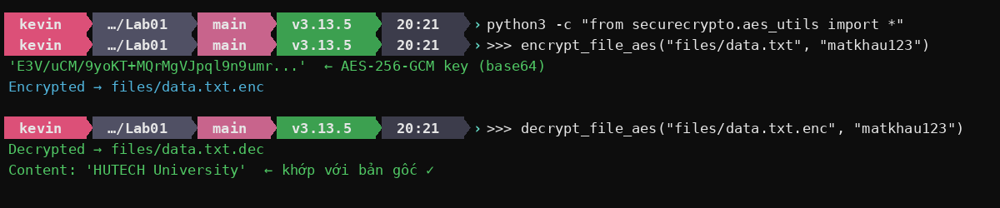
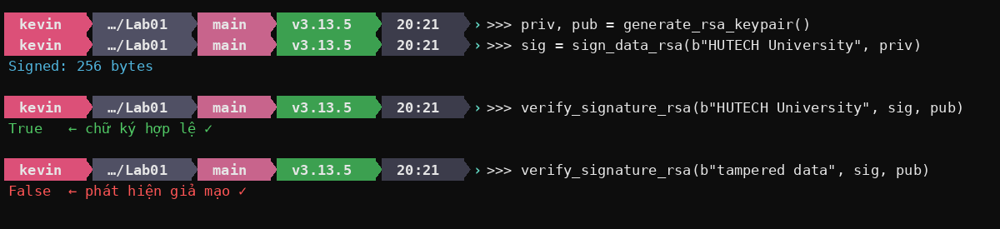
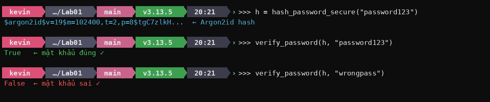

# Lab01 – Crypto Toolkit: Demo & Kết Quả

## Cài đặt

```bash
cd Lab01/crypto-toolkit
pip install -r requirements.txt
```

---

## 1. AES-256-GCM – Mã hóa file

```python
from securecrypto.aes_utils import encrypt_file_aes, decrypt_file_aes

key = encrypt_file_aes("files/data.txt", "matkhau123")
out = decrypt_file_aes("files/data.txt.enc", "matkhau123")
```



- Salt + Nonce được sinh ngẫu nhiên mỗi lần → cùng file, cùng password cho ciphertext khác nhau
- Key PBKDF2 100,000 iterations → chống brute-force
- GCM mode → phát hiện nếu file bị sửa (authenticated encryption)

---

## 2. RSA 2048-bit – Ký số & Xác thực

```python
from securecrypto.rsa_utils import generate_rsa_keypair, sign_data_rsa, verify_signature_rsa

priv, pub = generate_rsa_keypair()
sig = sign_data_rsa(b"HUTECH University", priv)
verify_signature_rsa(b"HUTECH University", sig, pub)   # True
verify_signature_rsa(b"tampered data", sig, pub)       # False
```



---

## 3. Argon2 – Hash mật khẩu

```python
from securecrypto.hash_utils import hash_password_secure, verify_password

h = hash_password_secure("password123")
verify_password(h, "password123")   # True
verify_password(h, "wrongpass")     # False
```



- Argon2id: memory-hard → chống GPU/ASIC brute-force
- Mỗi hash có salt riêng → cùng password cho hash khác nhau
