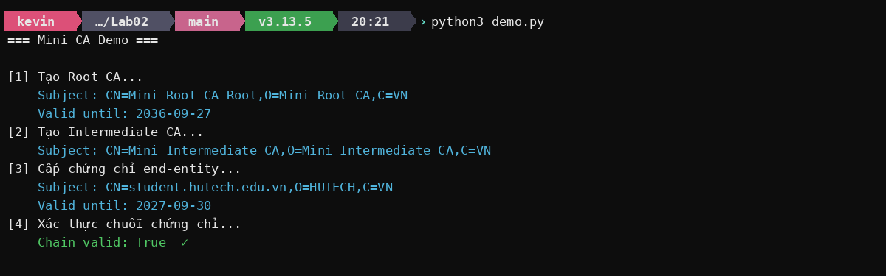
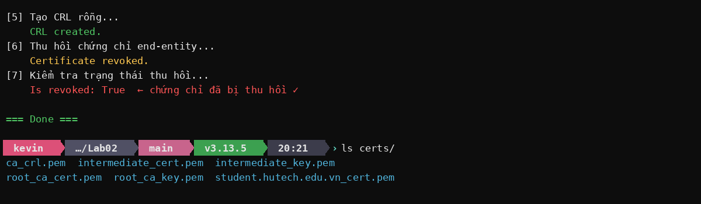

# Lab02 – Mini CA: Demo & Kết Quả

## Cài đặt

```bash
cd Lab02/mini-ca
pip install -r requirements.txt
python3 demo.py
```

---

## Luồng thực thi

### Bước 1–4: Tạo PKI 3 tầng + xác thực



- **Root CA**: self-signed, valid 10 năm, `path_length=1`
- **Intermediate CA**: ký bởi Root CA, valid 5 năm, `path_length=0`
- **End-entity**: ký bởi Intermediate CA, valid 1 năm, `ca=False`
- Chain verification: kiểm tra chữ ký + BasicConstraints + path_length từng tầng

---

### Bước 5–7: CRL & Thu hồi chứng chỉ



- CRL được ký bởi Intermediate CA, next_update sau 7 ngày
- Chứng chỉ thu hồi được tra cứu bằng serial number
- `check_revocation_status()` → `True` sau khi revoke

---

## File sinh ra trong `certs/`

| File | Mô tả |
|------|-------|
| `root_ca_key.pem` | Private key Root CA |
| `root_ca_cert.pem` | Chứng chỉ Root CA |
| `intermediate_key.pem` | Private key Intermediate CA |
| `intermediate_cert.pem` | Chứng chỉ Intermediate CA |
| `student.hutech.edu.vn_cert.pem` | Chứng chỉ end-entity |
| `ca_crl.pem` | Certificate Revocation List |
