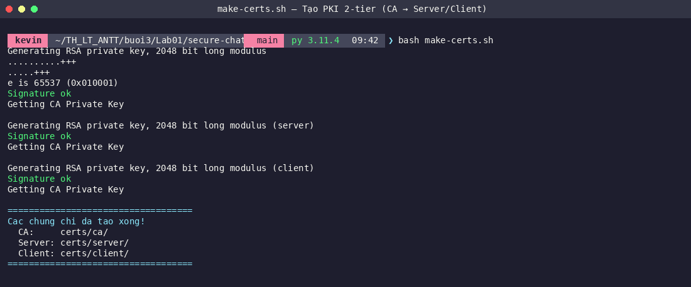
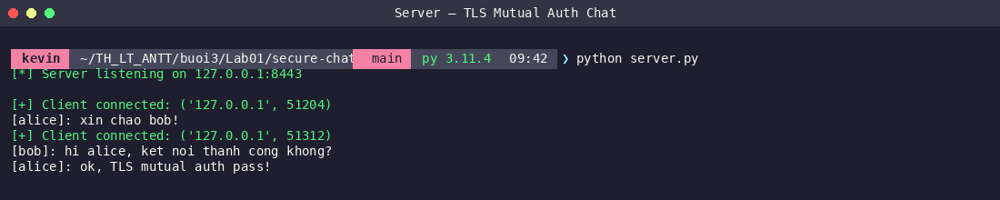
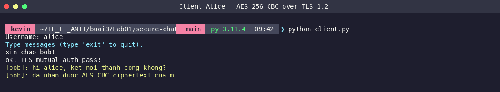

# Lab01 – Secure Chat: Demo & Kết Quả

## Cài đặt

```bash
cd Lab01/secure-chat
pip install -r requirements.txt
bash make-certs.sh   # tạo CA + server cert + client cert
```

---

## Kiến trúc bảo mật

| Lớp | Cơ chế |
|-----|--------|
| Transport | TLS 1.2+ (mutual auth, TLSv1/1.1 disabled) |
| Message | AES-256-CBC + PKCS7, IV ngẫu nhiên mỗi message |
| Auth | Certificate-based (server & client cùng xác thực nhau) |

---

## Chạy demo

**Bước 1: Tạo chứng chỉ**
```bash
cd Lab01/secure-chat
bash make-certs.sh
```



**Bước 2: Terminal 1 – Server**
```bash
python server.py
```



**Bước 3: Terminal 2 – Client alice**
```bash
python client.py
# Username: alice
```



---

## Luồng TLS Handshake

```
Client                          Server
  |--- ClientHello (TLS 1.2+) --->|
  |<-- ServerHello + Cert --------|
  |--- ClientCert + Verify ------->|
  |<-- Finished ------------------|
  |=== Encrypted channel =========|
  |--- username:aes_key_hex ------>|
  |--- AES-CBC(message) ---------->|
```

- Server chỉ chấp nhận client có cert ký bởi CA nội bộ (`CERT_REQUIRED`)
- Mỗi client dùng AES key riêng → server re-encrypt trước khi forward

---

## Phân tích bảo mật

### TLS Layer
- `OP_NO_TLSv1 | OP_NO_TLSv1_1` → bắt buộc TLS 1.2+
- Mutual authentication → chặn client giả mạo
- Certificate chain: CA → Server/Client (2-tier PKI)

### Message Layer
- IV ngẫu nhiên 16 byte mỗi lần → ciphertext khác nhau dù plaintext giống nhau
- Mỗi client có AES key riêng → server không forward raw ciphertext

### Điểm cần lưu ý (trong môi trường thực tế)
- Key trao đổi qua kênh TLS đã mã hóa → an toàn
- Trong lab này dùng CBC mode; production nên dùng AES-GCM để có authenticated encryption
